# gitpod-oracle-database-23c-free

Run a Gitpod workspace with an Oracle Database 23c Free instance

[](https://gitpod.io/#https://github.com/lucasjellema/gitpod-oracle-database-23c-free)

Read [this blog article](https://technology.amis.nl/database/get-going-with-oracle-database-23c-free/) for details on this Gitpod workspace. 

Once the workspace has started, the Oracle Database 23c Free instance is running in a Docker Container called *23cfree*.
You can access the database at port 1521 on localhost (from within the container and also from the Ubuntu host environment) - using user SYS (as SYSDBA) and password TheSuperSecret1509! (through CDB with service name FREE and PDB with service name FREEPDB1) or user *dev* with password *DEV_PW* (in service FREEPDB1).

From a bash terminal, you can connect into the database using SQL*Plus with this command that opens a terminal in the Docker container:

```
docker exec -it 23cfree sqlplus sys/TheSuperSecret1509! as sysdba
```

The database is started using the Docker Container image prepared by Gerald Venzl. See [Container Image Details](https://container-registry.oracle.com/ords/f?p=113:4:116729705491998:::4:P4_REPOSITORY,AI_REPOSITORY,AI_REPOSITORY_NAME,P4_REPOSITORY_NAME,P4_EULA_ID,P4_BUSINESS_AREA_ID:1863,1863,Oracle%20Database%20Free,Oracle%20Database%20Free,1,0&cs=3a8c38qNZ-qkPvm0nwLnAj8Beg7b1gzprb9XP2yQtQSyeZc-9cHiFA5wGa_B0KICeppaUQkKeYPGmbLqNb74OFg). 

SQLcl command line tool (see [SQLcl introduction](https://www.oracle.com/database/sqldeveloper/technologies/sqlcl/) for details) has also been installed in the Workspace (outside the Docker container) and can be accessed using:

```
alias sql="/workspace/gitpod-oracle-database-23c-free/sqlcl/bin/sql"
sql sys/"TheSuperSecret1509!"@localhost:1521/free as sysdba 
```  

A database user has been setup with username DEV and password DEV_PW in PDB `FREEPDB1`. The new role DB_DEVELOPER_ROLE  (introduced in 23c to supplement and replace role RESOURCE) is granted to this user.

A connection for this user is created in VS Code Oracle Developer Tools extension. 

Connect through SQLcl to this user can be done using:

```
alias sql="/workspace/gitpod-oracle-database-23c-free/sqlcl/bin/sql"
sql DEV/DEV_PW@localhost:1521/FREEPDB1 
```  

# Work against Oracle Database 23c Free from your local SQL Developer

Many of us like to work with a GUI – especially the free SQL Developer tool that over the years we have come to embrace. I will show how to work with a locally installed SQL Developer environment – running on your laptop – against this cloud based Oracle Database 23c Free instance in a Gitpod workspace. The final setup will look like this:
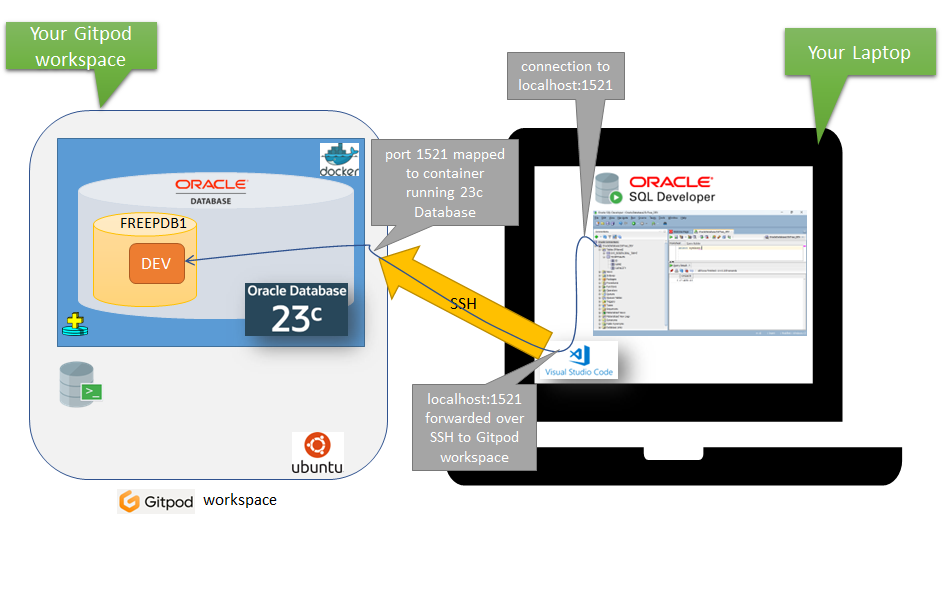

First – make sure you have got SQL Developer up and running on your local environment (starting from the SQL Developer downloads page if you do not yet have it). You also need to have VS Code on your local environment; this will be the conduit for the SSH connection over which SQL Developer will communicate with the database in the remote Workspace.

you need to bring the remote workspace to your laptop. Or rather: you create an SSH connecti0n through your local VS Code that will forward any local communication with port 1521 to the remote workspace. The steps to make this happen:

1. Open the Command Palette in the Gitpod Workspace (on my Windows machine I do this using CTRL SHIFT P ) and select "Gitpod: Open in VS Code".

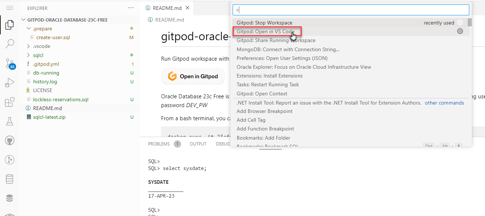

Alternatively, expand the File menu and click on Gitpod: Open in VS Code
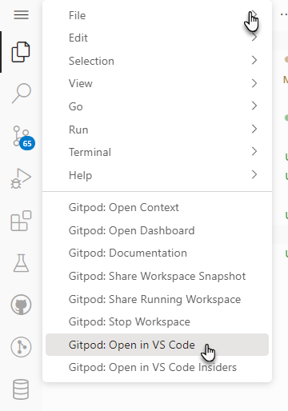

2. Accept the browser popup that notifies you of opening Visual Studio Code from the browser:

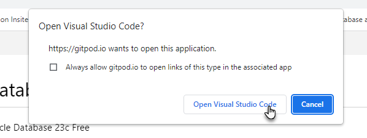

3. Click on Open when Visual Studio Code prompt you to "Allow an extension to open this URI?"

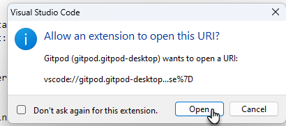

4. Click on Copy to save the temporary password for the SSH connection to the clipboard:

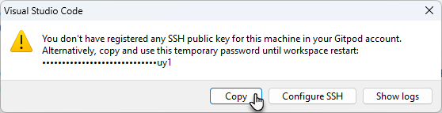

5. When this popup appears:

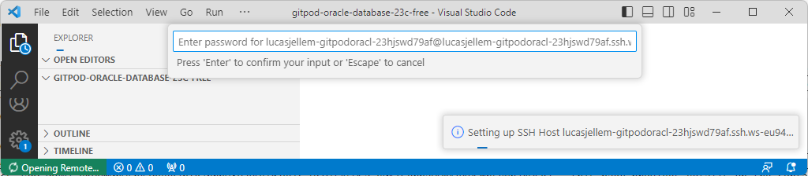

paste the password from the clipboard to the field and press enter:

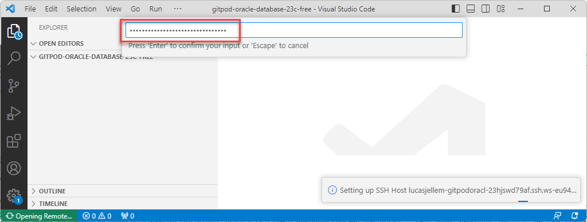

6. VS Code now opens and shows the same files and the same terminals as you saw before in the browser based VS Code environment:

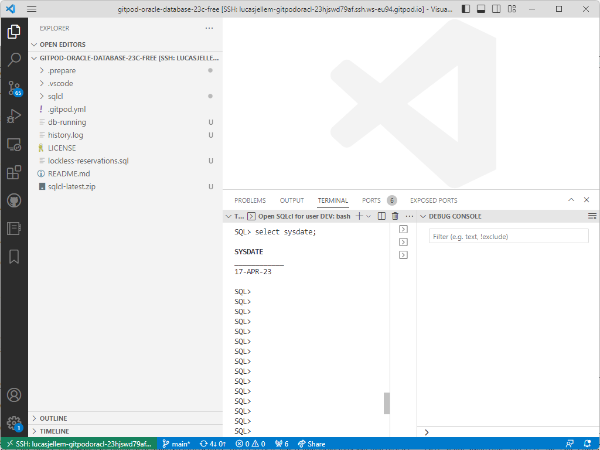

Open the ports tab

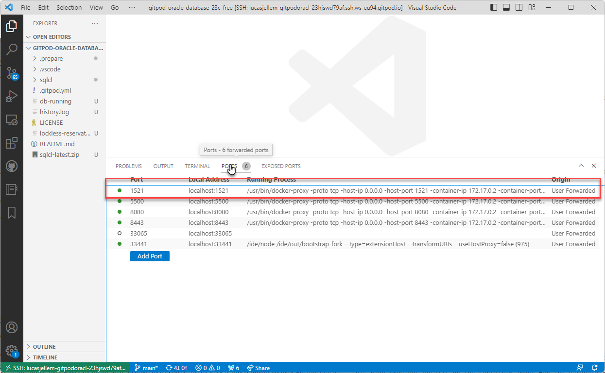

Here you can see the "magic" to connect the local port 1521 to the port 1521 exposed in the remote Gitpod workspace. Any attempt to access localhost:1521 on your laptop is now intercepted by VS Code and forwarded over the SSH connection to the Gitpod workspace. I think that is brilliant!

7. Time now to open SQL Developer

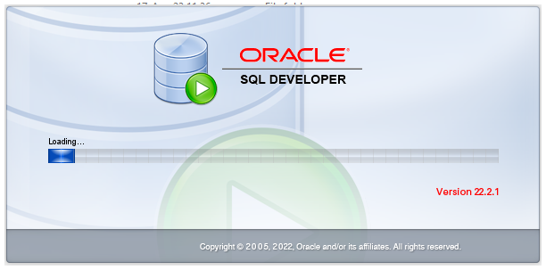

8. When it has started, you can define a new database connection – click on the plus icon and select New Database Connection

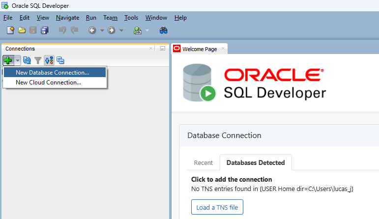
Then provide the connection details:
•username: dev
•password: DEV_PW
•Hostname: localhost
•Port: 1521
•Service Name: FREEPDB1

For convenience sake, you can check the box for Save Password.

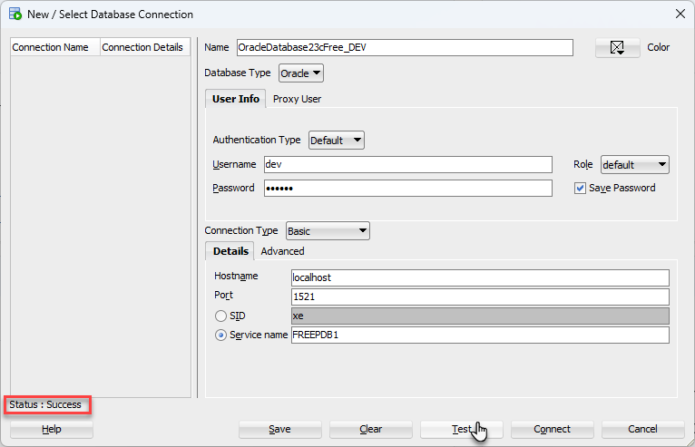

Click on Test to verify these connection details:


It is not spectacular in a visual way but the Status: Success message is reassuring. Now click Connect.

9. At this point, SQL Developer is connected to the DEV schema in the FREEPDB1 database running in your cloud based Gitpod workspace. And you can work against it just like you work with any Oracle Database 23c Free instance running anywhere.

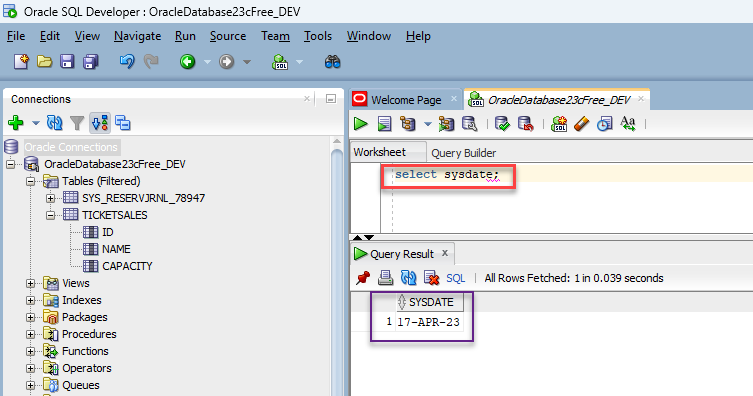

Here you see a telltale sign for 23c: select sysdate – at long last without including "FROM DUAL".


# Resources

Introducing Oracle Database 23c Free – Developer Release - Blog by Gerald Venzl Senior Director - 4th April 2023 - https://blogs.oracle.com/database/post/oracle-database-23c-free

Oracle Database Free Release Quick Start - https://www.oracle.com/database/free/get-started/

Oracle Container Registry –Database Repositories  – [Oracle Database Free](https://container-registry.oracle.com/ords/f?p=113:4:116729705491998:::4:P4_REPOSITORY,AI_REPOSITORY,AI_REPOSITORY_NAME,P4_REPOSITORY_NAME,P4_EULA_ID,P4_BUSINESS_AREA_ID:1863,1863,Oracle%20Database%20Free,Oracle%20Database%20Free,1,0&cs=3a8c38qNZ-qkPvm0nwLnAj8Beg7b1gzprb9XP2yQtQSyeZc-9cHiFA5wGa_B0KICeppaUQkKeYPGmbLqNb74OFg) – this page provides details on the container image for the database and how to connect to it.

Read [this blog article](https://technology.amis.nl/database/get-going-with-oracle-database-23c-free/) for details on this Gitpod workspace.